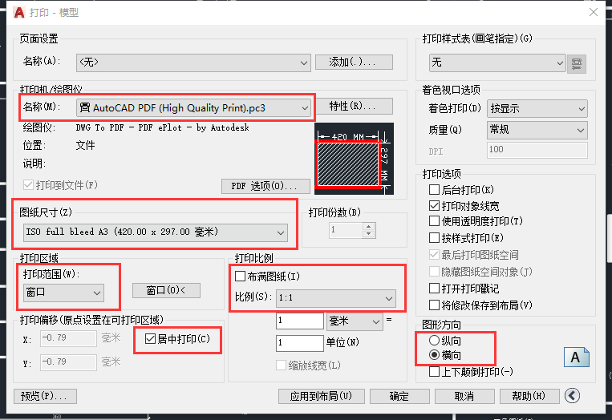

# A3 图纸的打印

*本篇笔记中 CAD 版本为2018版，不同版本间可能有区别，具体请百度*

以下为打印步骤：

1. 确保最外层图框大小为 `420*297mm` 大小，内外层图框间隔为 `10mm`，即内层图框大小为 `400*277mm`

   

2. 使用 CAD 自带的打印机输出 PDF

   

3. 打印机设置如下图设置，红框部分为需修改的地方，在设置打印窗口为范围时，需依次选中外图框 `左上角点` 和 `右下角点`，最后点击 `确定` 即可打印

   