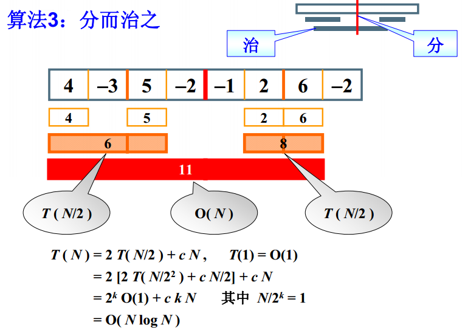

# 随堂笔记

## 第一讲 基本概念

### 1.1 什么是数据结构

计算多项式

```c++
// 常规算法, f(x) = a0 + a1*x + ... + an*x^n
#include <cmath>
double f(int n, double a[], double x) {
  int i;
  double p = a[0];
  for (i = 1; i <= n; i++) {
    p += (a[i] * pow(x, i));
  }
  return p;
}

// 优化算法, f(x) = a0 + x*(a1 + x*(a2 + ... x*(an)))
double f(int n, double a[], double x) {
  int i;
  double p = a[n];
  for (i = n; i > 0; i--) {
    p = a[i - 1] + p * x;
  }
  return p;
}
```

程序运行计时

```c++
#include <ctime>
#include <iostream>
using namespace std;

clock_t start, stop;
double duration;

int main() {
  start = clock();  // main 函数开始运行到 start 被赋值这个时刻一共走过的 ticks
  stop = clock();  // main 函数开始运行到 stop 被赋值这个时刻一共走过的 ticks
  duration = ((double)(stop - start)) / CLK_TCK;
  cout << duration;
  return 0;
}
```

### 1.2 什么是算法

算法：

* 有限的指令集

* 接受一些输入（可以不输入）

* 产生输出（必须）

* 在有限步骤之后终止

* 每一条指令必须

  a. 明确无歧义
  
  b. 计算机可处理
  
  c. 不依赖单独某一种特定的计算机语言

空间复杂度 S(n)

时间复杂度 T(n)

最坏情况复杂度 T<sub>worst</sub>(n)

平均复杂度<sub>Tavg</sub>(n)

> T(n) = O(f(n)) 表示存在常数 C>0, n0>0 使得当 n>=n0 时有 T(n) <= C·f(n)，是 T(n) 上界
>
> T(n) = Ω(g(n)) 表示存在常数 C>0, n0>0 使得当 n>=n0 时有 T(n) >= C·g(n)，是 T(n) 下界
>
> T(n) = Θ(h(n)) 表示同时有 T(n) = O(h(n)) 和 T(n) = Ω(h(n))

复杂度比较：

> 1 < log(n) < n < nlog(n) < n^2 < n^3 < 2^n < n!

Tricks:

* 若两段算法分别有复杂度 T1(n) = O(f1(n)) 和 T2(n) = O(f2(n))，则：
  
  * T1(n) + T2(n) = max(O(f1(n)), O(f2(n)))

  * T1(n) x T2(n) = O(f1(n) x f2(n))

* 若 T(n) 是关于 n 的 k 阶多项式，那么 T(n) = Θ(n^k)

* 一个 for 循环的时间复杂度等于循环次数乘以循环体代码的复杂度

* if-else 结构的复杂度取决于 if 的条件判断复杂度和两个分枝部分的复杂度，总体复杂度取三者中最大

### 1.3 应用实例：最大子列和问题

#### 分治算法

分治算法分为 3 步：

* 先找左半边最大子列和

* 再找右半边最大子列和

* 最后找中间跨越边界最大子列和



把复杂度记作 T(N)，则左半边复杂度为 T(N/2)，右半边复杂度也为 T(N/2)

对中间跨边界最大子列和的复杂度是 O(N) 即 cN

得到等式 ① ```T(N) = 2T(N/2) + cN```

将 ① 式中的 N 替换成 N/2 得到等式 ② ```T(N/2) = 2T(N/(2^2)) + cN/2```

将 ② 式代入 ① 式得到等式 ③ ```T(N) = 2(2T(N/(2^2)) + cN/2)+ cN```

化简得等式 ④ ```T(N) = (2^2)T(N/(2^2)) + 2cN```

分治算法代码：

```cpp
int Max3(int A, int B, int C) { /* 返回3个整数中的最大值 */
  // 可断句为 A > B ? (A > C ? A : C) : (B > C ? B : C)
  return A > B ? A > C ? A : C : B > C ? B : C;
}

int DivideAndConquer(
    int List[], int left,
    int right) { /* 分治法求List[left]到List[right]的最大子列和 */
  int MaxLeftSum, MaxRightSum;             /* 存放左右子问题的解 */
  int MaxLeftBorderSum, MaxRightBorderSum; /*存放跨分界线的结果*/

  int LeftBorderSum, RightBorderSum;
  int center, i;

  if (left == right) { /* 递归的终止条件，子列只有1个数字 */
    if (List[left] > 0)
      return List[left];
    else
      return 0;
  }

  /* 下面是"分"的过程 */
  center = (left + right) / 2; /* 找到中分点 */
  /* 递归求得两边子列的最大和 */
  MaxLeftSum = DivideAndConquer(List, left, center);
  MaxRightSum = DivideAndConquer(List, center + 1, right);

  /* 下面求跨分界线的最大子列和 */
  MaxLeftBorderSum = 0;
  LeftBorderSum = 0;
  for (i = center; i >= left; i--) { /* 从中线向左扫描 */
    LeftBorderSum += List[i];
    if (LeftBorderSum > MaxLeftBorderSum) MaxLeftBorderSum = LeftBorderSum;
  } /* 左边扫描结束 */

  MaxRightBorderSum = 0;
  RightBorderSum = 0;
  for (i = center + 1; i <= right; i++) { /* 从中线向右扫描 */
    RightBorderSum += List[i];
    if (RightBorderSum > MaxRightBorderSum) MaxRightBorderSum = RightBorderSum;
  } /* 右边扫描结束 */

  /* 下面返回"治"的结果 */
  return Max3(MaxLeftSum, MaxRightSum, MaxLeftBorderSum + MaxRightBorderSum);
}

int MaxSubseqSum3(int List[], int N) { /* 保持与前2种算法相同的函数接口 */
  return DivideAndConquer(List, 0, N - 1);
}
```

#### 在线算法

例如一个序列：-1，3，-2，4，-6，1，6，-1

第一步：读入 -1，小于0，抛弃

第二步：读入 3，ThisSum 大于 MaxSum，存入 MaxSum

第三步：读入 -2，ThisSum 小于 MaxSum，MaxSum 不变，ThisSum 不抛弃

...

算法代码：

```cpp
int MaxSubseqSum4(int A[], int N) {
  int ThisSum, MaxSum;
  int i;
  ThisSum = MaxSum = 0;
  for (i = 0; i < N; i++) {
    ThisSum += A[i];  // 向右累加
    if (ThisSum > MaxSum) {
      MaxSum = ThisSum;  // 发现更大和则更新当前结果
    } else if (ThisSum < 0) {  // 如果当前子列和为负
      ThisSum = 0;  // 则不可能使后面的部分和增大，抛弃之
    }
  }
  return MaxSum;
}
```

### 2.1 线性表及其实现

#### 补充知识

##### 关于 typedef

例如，C 语言在 C99 之前并未提供布尔类型，但我们可以使用 typedef 关键字来定义一个简单的布尔类型

```c
typedef int BOOL;  // 将 int 类型起一个别名叫 BOOL
BOOL flag = 1;
```

##### C 语言中的 struct

定义一个结构体类型:

```c
// 写法 1
struct Student {
  int num;
};
struct Student s;  // 声明变量
s.num = 10;

// 写法 2
typedef struct Student {
  int num;
} Stu;  // 即为 struct Student 类型起一个别名 Stu
Stu s;  // 声明变量，struct Student s; 也可以
s.num = 10;

// 写法 3
typedef struct {  // Student 此处可省略
  int num;
} Stu;
Stu s;  // 声明变量，struct Student s; 不可以
s.num = 10;

// 写法 4
struct Student {
  int num;
};
typedef struct Student Stu;  // 即为 struct Student 类型起一个别名 Stu
Stu s;  // 声明变量，struct Student s; 也可以
s.num = 10;
```

定义一个结构体指针:

```c
typedef struct Node {
  int num;
} * pNode;
```

定义一个包含指向自己指针的结构体指针:

```c
// 写法 1
typedef struct Node {
  int num;
  struct Node *pNext;
} * pNode;

// 写法 2
typedef struct Node *pNode;
struct Node {
  int num;
  pNode pNext;
};

// 写法 3
struct Node {
  int num;
  struct Node *pNext;
};
typedef struct Node *pNode;
```

##### C++ 语言中的 struct

定义一个结构体类型:

```cpp
// 写法 1
struct Student {
  int num;
};
Student s;  // 声明变量
s.num = 10;

// 写法 2
struct Student {
  int num;
} s;  // 声明变量
s.num = 10;

// 写法 3
typedef struct Student {
  int num;
} Stu;  // 即为 Student 类型起一个别名 Stu
Stu s;  // 声明变量，Student s; 也可以
s.num = 10;
```

定义一个包含指向自己指针的结构体:

```cpp
// 写法 1
struct Node {
  int num;
  Node *pNext;
};
```